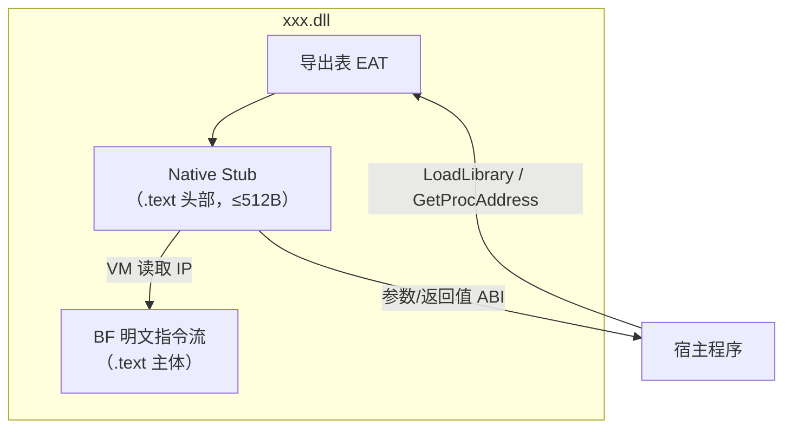

# BFDll 实验可行性报告

> 项目代号：第三种 DLL（Brainfuck-in-PE）  
> 日期：2026-06-25  
> 状态：**可行**，需在 PE 节区语义与 ABI 桥接上严格满足实验约束

---

## 1. 实验目标（硬性约束）

| # | 目标 | 含义 |
|---|------|------|
| 1 | 产物为 `xxx.dll` | 标准 Windows PE32/PE32+ 动态链接库，扩展名为 `.dll`，可被 `LoadLibrary` / 链接器识别 |
| 2 | 能被当成 DLL 用 | 具备合法导出表（EAT），宿主可通过 `GetProcAddress` / `import lib` 调用导出符号；加载、卸载行为符合 Windows Loader 规范 |
| 3 | 不能是「欺骗 DLL」 | **禁止**将 Brainfuck 预编译/即时编译为 x64/x86 机器码作为业务逻辑；磁盘与内存中「程序本体」不得是原生指令序列 |
| 4 | 不能是「伪装 DLL」 | **禁止**将 BF 明文藏在 `.rsrc` 资源、`.data` 杂项、外部文件或任意「非指令区」；解释器可以存在，但 BF 不能退化为附属数据 |
| 5 | BF 放在「放指令的地方」 | BF 明文必须占据 PE 中**本应由机器指令填充的区域**——即 `.text`（或与其等价的可执行节）的主体内容；打开十六进制编辑器或反汇编视图时，「代码区」看到的是 `+-<>[],.` 而非 `mov`/`push` |

**一句话定义第三种 DLL：**

> 外壳是合法 PE DLL；**代码节里躺的是明文 Brainfuck**；运行时由极小原生引导层启动 VM 解释执行；业务逻辑从不以机器码形式存在。

---

## 2. 可行性结论

**结论：完全可行。**

Windows 加载器是 PE 格式校验器，不是 Brainfuck 语义检查器。根据 [Microsoft PE Format 文档](https://learn.microsoft.com/en-us/windows/win32/debug/pe-format)：

- DLL **可以**有自定义节区布局；
- `AddressOfEntryPoint` / 导出 RVA **必须**指向 `.text` 内合法可执行内存（原生引导代码）；
- 同一 `.text` 节内**可以**并存「少量原生 stub」与「大量不可直接执行的 BF 字节」——CPU 只跳转至 stub，stub 以**数据方式**读取同节内的 BF 明文并解释。

因此：目标 1、2 由 PE 结构保证；目标 3 排除 AOT/JIT 编译路径；目标 4 排除资源嵌入路径；目标 5 通过 **BF 主体写入 `.text` 非入口偏移处** 满足。

---

## 3. 排除方案对照（实验边界）

### 3.1 「欺骗 DLL」——排除

| 做法 | 为何不符合 |
|------|------------|
| BF → x64 机器码（EBFC、自写 AOT 编译器） | `.text` 里是 `48 89 …`，不是 `+++` |
| Load 时 JIT，将 BF 翻译为 RX 内存再执行 | 运行时业务逻辑已是机器码；磁盘上 BF 只是编译输入 |
| BF → .NET IL（Brainfuck.NET / SharpFuck） | 属于第四种「托管 DLL」，且 IL 在 CLI 节而非 BF 明文 |

### 3.2 「伪装 DLL」——排除

| 做法 | 为何不符合 |
|------|------------|
| BF 放入 `.rsrc`（`RCDATA` / 自定义资源） | 资源区不是「指令区」 |
| BF 放入独立 `.bfcode` / `.rdata` 只读数据节 | 在 PE 语义里属于数据节，不是代码节；**不满足目标 5** |
| BF 放在 `.data` 或编译期字符串常量池 | 同上，属于数据而非指令区 |
| BF 外置 `.bf` 文件，DLL 运行时读取 | 指令不在 DLL 体内 |

### 3.3 本实验唯一合规形态

```
┌─────────────────────────────────────────────────────────┐
│  xxx.dll (PE32+)                                        │
├─────────────────────────────────────────────────────────┤
│  .text  [R + X]  ← 「放指令的地方」                      │
│    ├─ [0x0000] native stub / export thunks  (极小块)    │
│    └─ [0x0400] 明文 BF 程序主体  "++++[>++++<-]..."     │
│         ↑ CPU 不直接 jump 到这里；VM 按字节读取解释      │
├─────────────────────────────────────────────────────────┤
│  .edata / Export Directory → 指向 stub 地址              │
├─────────────────────────────────────────────────────────┤
│  .rdata  仅允许：导出名字符串、DLL 名称等 PE 必要元数据   │
│  .rsrc   不使用（或仅保留版本信息等，不含 BF）           │
└─────────────────────────────────────────────────────────┘
```

**关键原则：** BF 明文物理上位于 `.text`；逻辑上是指令流；物理上不对 CPU 直接可执行（由 VM 消费）。

---

## 4. 架构设计

### 4.1 三层结构



| 层级 | 位置 | 职责 | 体积目标 |
|------|------|------|----------|
| **L0 PE 壳** | DOS/NT Header、节表、导出目录 | 让 Windows 承认为 DLL | 固定开销 ~1KB 级 |
| **L1 Native Stub** | `.text` 起始 | 导出跳板、ABI 封送、启动/停止 VM | 尽量小（百字节～KB 级） |
| **L2 BF 指令流** | `.text` 主体 | **全部业务逻辑**，明文 `+-<>[],.` | 占 `.text` 绝大部分 |

### 4.2 为何 BF 必须在 `.text` 而非其他节

PE 的「指令区」在链接器与工具链中的默认映射：

| 节名 | 典型属性 | 实验角色 |
|------|----------|----------|
| **`.text`** | `IMAGE_SCN_CNT_CODE \| MEM_READ \| MEM_EXECUTE` | ✅ **BF 明文主存放区** |
| `.rdata` | 只读数据 | ❌ 不可放 BF 程序本体 |
| `.data` / `.bss` | 可读写数据 | ❌ 不可放 BF 程序本体 |
| `.rsrc` | 资源 | ❌ 明确禁止 |

使用 `#pragma code_seg` 或链接器 `/SECTION` 将 BF 汇编/嵌入到 `.text` 段中：

```c
// 示意：BF 作为 .text 内的字节序列（非 CPU 入口）
#pragma code_seg(".text$bf", "R")   // 子段只读，合并进 .text
__declspec(allocate(".text$bf"))
const char g_bf_program[] =
    "++++[>++++<-]>+.<<<<<";       // 明文指令，位于代码节

// Stub 在 .text$stub，含实际 EXPORT 符号
#pragma code_seg(".text$stub")
__declspec(dllexport) int __cdecl BF_Add(int a, int b) {
    return bf_vm_run(g_bf_program, a, b);  // VM 解释 .text 内 BF
}
```

链接时通过 `/MERGE:.text$bf=.text` 与 `/MERGE:.text$stub=.text` 合并为单一 `.text`，满足「指令在代码节」的实验定义。

---

## 5. 核心实现要点

### 5.1 Native Stub（不可省略，但不算「欺骗」）

Stub 是 PE 格式要求的**最小原生胶水**，职责限定为：

1. 接收宿主调用（x64：`RCX`、`RDX`…；x86：`cdecl`/`stdcall`）；
2. 初始化纸带（tape），写入参数；
3. 将 IP 指向 `.text` 内 BF 起始偏移；
4. 运行解释循环（可在 stub 同文件，或同节内另一 stub 函数）；
5. 从约定 cell 读取返回值 → `RAX` / `EAX`，`ret`。

**Stub 不是业务逻辑**；业务逻辑 100% 在 BF 明文中。这与「C 运行时启动 main」同理：启动器是原生代码，程序语义在源码层。

### 5.2 VM 解释器的位置

| 方案 | 是否符合实验 | 说明 |
|------|--------------|------|
| 解释器 C 源码编译进 `.text` stub 区 | ✅ 推荐 | 与 BF 共存于代码节；BF 占主体体积 |
| 解释器放 `.text` 末尾，BF 放中间 | ✅ | 多函数时 BF 分块排列 |
| 解释器放 `.rdata` | ⚠️ 边界 | 可行但违背「代码节即程序」精神；建议解释器也进 `.text` |
| 解释器放 `.rsrc` | ❌ | 接近「伪装」 |

实验建议：**解释器 + BF 均在 `.text`**；用 `dumpbin /rawdata:1,`.text` 应能看到大量 ASCII `0x2B 0x2D 0x3E…`（`+ - >`）。

### 5.3 ABI 桥接（最难的工程点）

Brainfuck 无寄存器；必须文档化「宿主 ↔ 纸带」映射：

```
约定示例（可调整，但需固定）：
  cell[0] = 输入参数 a
  cell[1] = 输入参数 b
  cell[0] = 返回值（执行结束后）
  IP 终止条件：遇到 '\0' 或 '@' 停机符
```

多导出函数时，每个 Export 对应：

```
Export BF_Add    → stub 设置 IP = &g_bf_add    （.text 内偏移 0x400）
Export BF_Mul    → stub 设置 IP = &g_bf_mul    （.text 内偏移 0x800）
```

导出表指向 **stub 地址**，永不指向 BF 字节中间（避免 CPU 误执行 `+` = `0x2B`）。

### 5.4 I/O 指令 `,` 与 `.` 的重定义

标准 BF 的 console I/O 在 DLL 中无意义。VM 内重定义为：

| 指令 | 实验语义建议 |
|------|--------------|
| `.` | 写入 `OutputDebugStringA` 单字符，或写入宿主提供的 buffer |
| `,` | 从 tape 预置区读取，或返回 0 |

### 5.5 DllMain 约束

遵循 [DllMain 文档](https://learn.microsoft.com/en-us/windows/win32/dlls/dllmain)：

- `DLL_PROCESS_ATTACH`：**不做** BF 解释、不 JIT、不 `LoadLibrary`；
- 可选：清零 tape 静态状态；
- 重逻辑延迟到首次导出函数调用（lazy init）。

### 5.6 构建产物验证清单

实验验收时逐项检查：

```powershell
# 1. 是 DLL
dumpbin /headers xxx.dll | findstr "DLL"

# 2. 有导出
dumpbin /exports xxx.dll

# 3. BF 在 .text，不在 .rsrc
dumpbin /summary xxx.dll
dumpbin /section:.text xxx.dll

# 4. 十六进制可见明文 BF（非 48 8B 等机器码为主）
#    在 .text 偏移处应看到 2B 2D 3E 3C 5B 5D 2E 2C (+-><[].,)

# 5. 无 BF 资源
dumpbin /summary xxx.dll   # .rsrc 应不存在或体积极小且无 RCDATA 大块
```

---

## 6. 技术风险与限制

| 风险 | 等级 | 应对 |
|------|------|------|
| `.text` 内 BF 字节被误当作代码反汇编 | 低 | 预期行为；可用注释块 `$` 或 `;`（若扩展指令集）分隔 |
| DEP / CFG | 低 | 导出只指向 stub；BF 区域虽在 RX 节但 IP 不落入 |
| 性能 | 中 | 解释执行慢 10²～10⁶ 倍；实验项目可接受 |
| 多函数 BF 块对齐 | 低 | `.text` 内用 `\0` 分隔 + 偏移表 |
| 杀毒启发式 | 低 | 自写 VM + 非常规 .text 布局可能误报 |
| x86/x64 双平台 | 中 | Stub 需分架构；BF 源码可共用 |

---

## 7. 与「两种常见 DLL」对比

| 类型 | 代码节内容 | 运行时执行体 | 本实验 |
|------|------------|--------------|--------|
| 原生 DLL | x64 机器码 | CPU 直接执行 | — |
| 托管 DLL | CLI metadata + IL | CLR JIT | — |
| **第三种 DLL** | **明文 Brainfuck** | **Native Stub + VM 解释** | ✅ |

---

## 8. 推荐 MVP 路线

### Phase 1 — 证明「BF 在 .text 的 DLL 能跑」

1. 手写最小 VM（~200 行 C，8 指令）。
2. 单 BF 程序 `hello.bf`（通过 `.` 输出到 `OutputDebugString`）。
3. 链接为 `hello.dll`，导出 `void BF_Run(void)`。
4. 宿主 `LoadLibrary` + `GetProcAddress("BF_Run")` 调用。
5. `dumpbin` + 十六进制编辑器确认 BF 在 `.text`。

### Phase 2 — 证明「像真 DLL 一样有 ABI」

1. 增加 `BF_Add(int,int)` 导出，BF 实现加法。
2. 参数/返回值走 tape 约定。
3. 提供 `.lib` + `bf_dll.h` 供 C 宿主静态链接导入。

### Phase 3 — 工具链

1. `bf2textsect`：`.bf` → 生成 `.text` 嵌入汇编/对象。
2. CMake 一键：`xxx.bf` → `xxx.dll`。

---

## 9. 最终判定

| 实验目标 | 可行性 | 实现关键 |
|----------|--------|----------|
| 1. 输出 xxx.dll | ✅ | 标准 MSVC/MinGW 链接 `-shared` |
| 2. 当 DLL 用 | ✅ | Export Directory + 正确 calling convention |
| 3. 非欺骗（无 BF→机器码） | ✅ | 仅 Stub VM 解释，禁止 AOT/JIT 业务编译 |
| 4. 非伪装（不在资源区） | ✅ | 禁止 `.rsrc`/`.rdata` 存 BF 主体 |
| 5. BF 在指令区 | ✅ | **BF 明文嵌入 `.text` 主体** |

**第三种 DLL 的本质：** 把 PE 的「代码节」从机器指令域重新定义为 **Brainfuck 源码域**；Windows 仍把它当 DLL，CPU 只执行极小的原生引导层，真正的「程序」是对 `.text` 里 ASCII 指令流的解释执行。

---

## 10. 参考

- [PE Format - Microsoft Learn](https://learn.microsoft.com/en-us/windows/win32/debug/pe-format)
- [DllMain entry point](https://learn.microsoft.com/en-us/windows/win32/dlls/dllmain)
- [#pragma section / __declspec(allocate)](https://learn.microsoft.com/en-us/cpp/preprocessor/section?view=msvc-170)
- [/MERGE (Combine Sections)](https://learn.microsoft.com/en-us/cpp/build/reference/merge-combine-sections?view=msvc-170)
